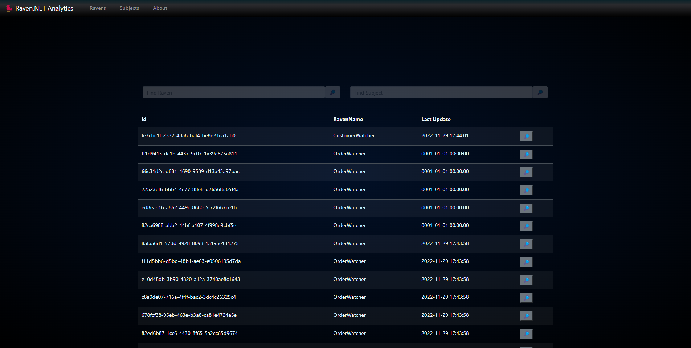

## Raven.NET Analytics

Analytics is an additional package whose main purpose is to work on the application, but it can also be used for audit purposes. We do not rule out further development of this package to enrich it with additional functions. Below is a screenshot that shows how the package works on the example of our WebApi demo project.



For the preparation of the frontend, we used simple jquery mechanisms with the bootstrap library and as the backend there is a minimal .net 6 api.

There are two usable views available in the application, ravens and subjects. In the subject view, we can find the time of the last update and we can also view the current state of the object


****
### Installation & Usage

Its additional package so you need to install it via dotnet or nuget

> dotnet add package Raven.NET.Analytics

> Install-Package Raven.NET.Analytics

To use analytics only oneliner below is required. (it has optional parameter, to populate collections with random data, in case you want to checkup if everything is configured correctly)
```c#

    services.AddRavenAnalytics();

```