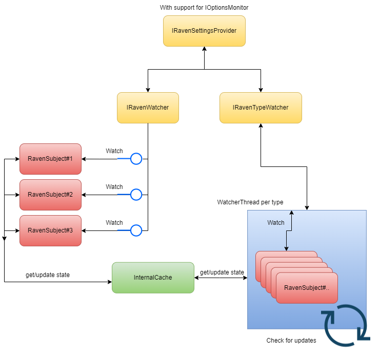

- [General overview](#general-overview)
  - [Flow Diagram](#flow-diagram)
  - [Use cases](#use-cases)
    - [Audit trails](#audit-trails)
    - [Simple event source](#simple-event-source)
    - [Notification services](#notification-services)
    - [Loose coupling between objects](#loose-coupling-between-objects)
  - [Follow-up documents](#follow-up-documents)

# General overview

Welcome to documentation page of Raven.NET framework. On this page you will find a general overview of possibilities that the library can provide, and additionally you can check some hyperlinks that will redirect you to a page that may give you more detailed information about specific topic.

## Flow Diagram
The diagram below is to give a little bit of understanding what the way the system is prepared to work. This should also describe core differences between default watcher and type watcher.

## Use cases

Animal reference makes it easy to relate between code and real world perspective. It makes nice use of publisher/subscriber template and additionally, it encapsulates SOLID principles as you can easily extend already built scenario without modifying old code, and you can create "army" of ravens that will have its own single responsibility. Animal reference should also make you possible to guess some use cases, but then in this page we will describe some that we can think about.

### Audit trails

For implement audit services, when you want to keep track of specific objects. Each time you need to know how objects are changing within the time, Then Raven.NET is the valid choice for you. This library will allow you to have one to many reaction, and you can decide how many watchers you want to have, and you can react on changes differently. This allows you to react to one change differently that you will react to another. For audit specific case, it's also good that the library does not overwrite the watched object. Then you can be sure that you have clean audit that only provide solution for your specific case.

### Simple event source

You may have a scenario in your system where you need to have some kind of events that you generate base on changes in different objects. There are plenty ready to use frameworks and services that are created to satisfy this functionality, and to make it purly clear. Raven.NET is not a framework that provides event sourcing. But for specific simple scenario when you just want to be notified when an object changes, for example you have a collection of cars, and want to be notified when some process change price of a specific car. 

### Notification services

Thats part of the definition for observer pattern, if you need subscriber, and publisher way of work implemented, then Raven.NET can provide it to you out of the box. This may be usefull as well for some PoC applications when you plan to go for more event source base, but for MVP you don't want to spend a lot of resources for infrastructure. Then as well, you may find it beneficial.

### Loose coupling between objects

As mentioned before Raven.NET implement subscriber and publisher structures, with this you really have minimal coupling between objects. You only have simple connection on subscriber relation, but that's it, having this you can implement own reaction on object change without architecture overkill. 

## Follow-up documents

- RavenWatcher interface: [Link](RavenWatcher.md)
- RavenTypeWatcher inferface: [Link](RavenTypeWatcher.md)
- RavenProvider interface: [Link](RavenProvider.md)
- Configuration: [Link](Configuration.md)
- Analytics package: [Link](Analytics.md)
- Examples: [Link](/Demos/)

