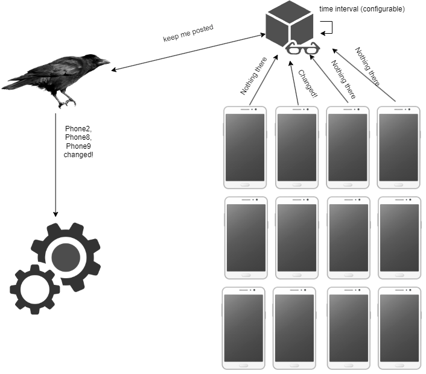

- [RavenTypeWatcher](#raventypewatcher)
  - [Available methods:](#available-methods)
  - [Usage example](#usage-example)

## RavenTypeWatcher

This page will describe more advanced variant of RavenWatcher and this will be RavenTypeWatcher interface. As you may already know, this will be used to watch all objects of a given type. To use this interface, you need to inject IRavenTypeWatcher interface. Keep in mind that this may be more useful for specific cases, but as well is more resource consuming, because will add a thread that will be acting like watchdog. The diagram below may give you some sense about the way of working for this observer.



### Available methods:

`public IRavenTypeWatcher Create<T>(string name, string keyName, Func<RavenSubject, bool> callback, Action<RavenSettings> options = null)` - Similar to RavenWatcher method to create watcher will act the same way, the core difference is new parameter "keyName" that will be used to differentiate objects of the same type to find differences. For example, if we load objects from database each 5s, then this method will use this property to check if newly loaded object is already in raven cache. 

Params:
- string name: name of watcher (has to be unique)
- string keyName: key to identify objects of given type (key does not have to be unique but having two different objects with same kay can cause unexpected behaviour)
- Func<RavenSubject, bool> callback: Action callback for updating subjects
- Action<RavenSettings> options: Options to configure raven, if not provided then raven will be created with options from appsettings, but if provided - options from configuration will be overwritten.

`public void Exclude(RavenSubject subject)` - Method to exclude subject from watcher list. In type watcher we don't have watch method, because by default all objects of same type are watched. Then we have a method to exclude subject if for some reason we don't want to receive updates about its changes.

Params: 
- RavenSubject subject: Object we want to remove from watcher list, 

`public void Stop(string name)` - Similar to the method in standard RavenWatcher, this will clear type watcher list and, will block new incomming updates about changes in a given type.

Params: 
- string name: name of watcher that will be stopped.

****
### Usage example

```c#
_ravenTypeWatcher.Create<Car>("RavenTypeWatcherExample", nameof(Console.Car.Id), Callback);

 var Car = new Car(1231, "Qudi", "Q2", 40000);
        
 var Car2 = new Car(1231, "Qudi", "Q2", 43000);
```


In the example above you can see that It's pretty simple, when you have the same id (in that case it's 1231) then in your callback function you will be able to catch update

