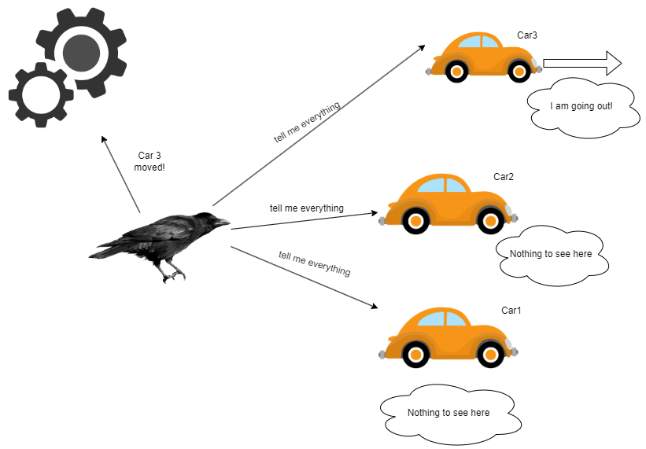

- [Raven Watcher](#raven-watcher)
  - [Available methods:](#available-methods)
  - [Usage example](#usage-example)


## Raven Watcher

This is a basic interface that provides general purpose functionality of watching changes within objects. To access it, you need to inject IRavenWatcher interface. Below you can find a diagram that should briefly in simple words describe the way of working for this interface. 




### Available methods:

`IRavenWatcher Create(string name, Func<RavenSubject, bool> callback, Action<RavenSettings> options = null)`  - Method responsible for initializing watcher. It uses fluent builder style, so it returns interface itself. 

Params:
- string name: name of watcher (has to be unique)
- Func<RavenSubject, bool> callback: Action callback for updating subjects
- Action<RavenSettings> options: Options to configure raven, if not provided then raven will be created with options from appsettings, but if provided - options from configuration will be overwritten.

`public IRavenWatcher Watch(RavenSubject subject)` - Method that is used to add subject that will be observed. Subject is added to internal collection.

Params:
- RavenSubject subject: Object that will be watched. All objects that are delivered to watchers should derive from RavenSubject class.

`public void UnWatch(string name, RavenSubject subject)` - Method to remove watcher from internal collection. 

Params: 
- string name: name of watcher (can be used for example if you want to unsubscribe to subject after already creating watcher)
- RavenSubject subject: subject to perform unsubscribe on it.


`public void Stop(string name)` - Method to stop raven, and that means unsubscribe to all subjects that are registered to it.

****
### Usage example


```c#
var watcher1 = _ravenWatcher1.Create("Raven1", PhoneUpdated, (options) => { options.AutoDestroy = true; });

watcher1.Watch(testPhone2).Watch(testPhone3);

testPhone2.Price = 420;
testPhone2.TryNotify();

```